# Multiple AI Agent 产品优化与工程论文执行计划

> 版本：v1.2-two-case-decision-integrated｜初版日期：2026-09-04｜本次修订：2026-09-06｜项目：`multiple_ai_agent`  
> 目标：在不重复 Qwen2.5 失败路线的前提下，完成可审计的产品优化、Single vs Multi 与 LLM vs SLM 对照实验，并形成工程论文可直接使用的证据链。  
> 重要范围：本计划不讨论 AI 使用披露；项目已获授权，论文只需聚焦系统、实验、证据和结论。
> 时间解释：工作顺序按依赖关系执行，但不得自动假设从修订时点起重新拥有完整48小时；必须以真实提交截止时间倒排。

## 🎯 0. 执行摘要：先做这八个决定

| 决定 | 结论 | 为什么 |
|---|---|---|
| Phase 5 状态 | 受控 Web Research 已经实现并通过专项测试，但“Web 证据进入系统”不等于“证据已正确传到最终 claim” | 当前仍存在 Web-only 被整体降为 low、Research 缺少结构化 `source_ids` 等问题 |
| 指标优先 | 使用已确认的最终质量、安全、Confidence、可靠性、资源和最小过程指标，再改 Critic 架构 | 避免旧指标从验收、图表或论文中被重新引入 |
| 本地 SLM | 首选 **IBM Granite 4.0 H Micro Q4_K_M，实际设 32K context**；内存不足时降级 Granite 4.0 H 1B | Hybrid Mamba2/Attention 架构对长上下文的 KV 内存更友好，适合本机 16 GB RAM / 2 GB VRAM 约束[^granite-micro][^granite-docs] |
| Critic 架构 | C（Gemini）与 D（Granite）均在 Research、Strategy、Finance 后加 role-specific critic，Writer 后保留 final critic；B（Gemini）仅保留 final critic | B/C/D 均只在相应检查失败时修订，最多一次；Supervisor 与 RAG/Web 使用确定性 validator |
| 动态控制 | 可以做，但应实现为 **bounded adaptive quality-gated workflow**，不是自由自治 Supervisor | 动态性来自 conditional edge 和状态规则，不来自换模型；每个角色最多一次返工，必须有 call/token/time 上限[^langgraph-router][^langgraph-graph] |
| 公平比较 | A–D 使用相同 brief、冻结 evidence、32K 共同上限、相同 schema/chunking，并统一应用 provenance/Confidence 基础修复 | 正式实验禁止实时补搜；本轮不做“各模型最佳配置”的产品次实验 |
| 正式实验量 | 锁定 8 个 planned runs：相同 2 cases × A–D，每组 2 次；Gemini 6 次＋Granite 2 次 | 8 是计划运行数，不保证8次成功；独立样本量 n=2，定位为两案例工程验证；预检与调试调用另计，不预排稳定性重复 |
| Confidence | 描述 Claim Grounding、Assumption Transparency 和 High-impact Unsupported Claim Rate | 不声称本轮已识别Confidence改造的独立校准收益，也不把low数量作为优化目标 |

本轮短期冲刺的产品目标不是“完成所有未来架构”，而是交付一个可运行、可比较、可写入论文的最小闭环：

```text
指标与协议冻结
  → confidence / provenance 修复
  → per-agent review gates
  → bounded dynamic revision
  → 两案例四组对照：Gemini Single/Multi、角色级审查、优化 Multi 的 Gemini/Granite
  → 自动指标 + 全部可评分 canonical 输出盲评 + 一次性 claim 审计
  → 论文 1–14 问的证据映射
```

## 🔎 1. 当前系统基线与关键诊断

### 1.1 当前事实，不应继续沿用的表述

| 主题 | 当前代码事实 | 论文应如何写 |
|---|---|---|
| 主流程 | `validator → supervisor → research → strategy → finance → rag_retrieval → writer → critic → revision → export` | 当前版本是静态、确定性的 LangGraph 编排 |
| Supervisor | 主图安装固定五角色计划，传入的 `supervisor_llm` 未用于运行时选路 | 不得写成 LLM 动态调度或自主任务分配 |
| Critic | 只接收 `ProposalDraft`，只能在 Writer 后审查完整计划书 | 当前是 final-only critic，错误可能在 Agent 间传播 |
| Web Research | 已进入 Research prompt，并有受控来源流程 | Phase 5 功能存在，但 source-to-claim 血缘尚未完整结构化 |
| Confidence | 任一 key claim 不是 `sourced_fact` 时，整节可被强制降为 low；Web-only 仍触发全局低置信 | 13/13 节 low 很大部分是规则设计结果，不等同于模型“完全不确定” |
| SLM | 现有 `slm/` 仍围绕 Qwen2.5/托管迁移历史，完整本地链路曾严重超时 | Qwen2.5 路线停止；旧数据作为失败基线，不再重复投入 |

主要代码证据位于：

- `workflow/multi_agent_graph.py`：固定节点和固定边；
- `workflow/multi_agent_nodes.py`：`build_deterministic_supervisor_plan()` 与 Web/RAG evidence mode；
- `agents/critic.py`：当前 Critic 强制解析为 `ProposalDraft`；
- `schemas/workflow.py`：section confidence 的强制降级规则；
- `schemas/agent_outputs.py`：`WriterInput` 的 `low_confidence_required`；
- `agents/writer.py`：最终 confidence floor；
- `slm/README.md`：Qwen2.5 本地 32K 失败、paging 和超时记录。

### 1.2 当前与目标架构

```mermaid
flowchart LR
    accTitle: 当前静态多 Agent 工作流
    accDescr: Research Strategy 和 Finance 的输出未经局部审查，直到 Writer 完成后才由最终 Critic 发现问题。
    V[Validator] --> S[Static Supervisor]
    S --> R[Research]
    R --> T[Strategy]
    T --> F[Finance]
    F --> G[RAG Retrieval]
    G --> W[Writer]
    W --> C[Final Critic]
    C --> X[Revision]
    X --> E[Export]
    classDef risk fill:#fee2e2,stroke:#b91c1c,color:#111827;
    class R,T,F risk;
```



当前架构最大的问题不是“没有更多 Agent”，而是质量控制位置太晚：Research 的来源问题会污染 Strategy，Strategy 的假设会进入 Finance，Finance 的数字又会被 Writer 重述。最终 Critic 即使发现问题，也需要同时修 13 个章节，成本高、定位差，并且可能引入新的缺陷。

### 1.3 `Confidence: low` 的四个根因

1. **聚合规则过度保守**：只要一条 claim 是 assumption 或 needs-validation，整节就可能变成 low。商业计划天然含未来假设，因此全 low 是规则的可预期产物。
2. **Web-only 被错误视作无外部证据**：当前全局 floor 主要看 `has_rag`，未把可信 Web evidence 等价纳入。
3. **Research 缺少结构化来源血缘**：finding 主要通过自由文本 rationale 携带来源信息，后续无法确定性验证 `claim → source_id → evidence snapshot`。
4. **Revision 只能继续降低，很难在问题真正修复后恢复为 medium**：这会造成系统性低标签，但本轮矩阵不单独估计该旧规则修复的因果收益。

因此，增加更多 Critic 只能改善逻辑和完整性；如果不先修 evidence provenance 与 confidence 语义，Critic 数量增加后仍会输出大量 low。

### 1.4 本机资源边界

本次资源检测结果：

| 资源 | 实测/识别值 | 对方案的影响 |
|---|---:|---|
| CPU | Intel i7-1165G7，4 核 / 8 线程 | 本地生成以 CPU 为主，必须单并发 |
| RAM | 15.8 GiB，总空闲约 4.41 GiB | 运行 3B 32K 前应先释放到至少约 7 GiB 可用内存 |
| GPU | NVIDIA MX450，2 GiB VRAM | 只能作为少量 offload 加速，不应按“模型可完全装入 GPU”规划 |
| Disk | 约 34 GiB 可用 | 只下载主模型和 1 个降级模型，不做候选模型仓库式试错 |

标称 128K/256K 是模型能力上限，不是这台电脑可实际使用的窗口。对本项目，32K 是 Granite H Micro 的实验上限；是否真的可用必须通过真实最大 prompt 的 preflight 决定。

## 🧭 2. 研究目标、研究问题和范围边界

### 2.1 产品与研究任务

研究任务应统一表述为：

> 构建一个能够把结构化 business brief 和受控证据转换为 13 章节、可追溯、商业可执行计划书的 Agentic 系统，并在受限硬件和 API 预算下，评估多 Agent 分工、局部 Critic 与动态质量门是否改善质量、可靠性与资源表现。

### 2.2 研究问题

| 编号 | 研究问题 | 主要估计量 |
|---|---|---|
| RQ1 | Gemini 下，相同 brief、证据和输出契约下，Multi 与 Single 有何差异？ | Q(B) − Q(A) |
| RQ2 | 相同角色级＋最终 Critic、失败才修订的 Multi 架构下，Gemini 与 Granite 有何差异？ | Q(C) − Q(D) |
| RQ4 | Gemini 下，增加角色级审查与条件修订有何效果？ | Q(C) − Q(B)；同时报告质量、安全、完成率及资源 |
| RQ6 | 质量收益是否值得额外的失败风险、运行时间、请求、token 与内存资源？ | 质量—可靠性—资源权衡 |
| RQ7 | 输出的证据支持、假设透明度及高影响无支撑声明表现如何？ | Claim Grounding、Assumption Transparency、High-impact Unsupported Claim Rate |

本轮取消 Granite Single 组与固定修订对照，不估计模型×架构交互作用，也不比较固定修订与条件修订。研究结论限定于两个 case。

其中 `Q` 为人工盲评 Academic Quality Score。High-impact Unsupported Claim Rate 作为独立安全结果；完成率、首次自动契约有效计划时间、请求/token/重试和内存资源分别报告，不合成总分。本轮不测 ROI、人工节省或货币成本。

### 2.3 本轮明确不做

- 不再尝试 Qwen2.5 或另一个托管平台；
- 不做微调、蒸馏或训练 learned router；
- 不做无限循环或自由创建 Agent 的 fully autonomous supervisor；
- 不做超过8个 planned runs 的稳定性重复或扩展矩阵；
- 不同时修改 prompt、模型、证据和架构后声称某一个因素有效；
- 不以字符串替换方式把 `low` 改成 `medium/high`；
- 不在正式实验开始后继续随意调 rubric 或删除失败 runs；
- 不把重复 seed 当作新的独立 case；
- 不引入新的前端或替换 LangGraph 框架。
- 不做各模型最佳配置的产品次实验；
- 不用本轮 A–D 结果声称 Confidence 基础修复产生了独立因果收益。

## 📏 3. 先冻结专业指标体系

### 3.1 指标设计原则

1. **最终结果与过程分开**：计划书好看不代表协作正确；协作日志丰富也不代表输出可用。
2. **质量与资源分开**：不把质量、token、时间、请求和内存强行合成单一分数；并列解释权衡。
3. **模型自评不能当真值**：Critic 的 `overall_score` 不能证明 Critic 有效。
4. **失败进入分母**：API timeout、schema failure、context overflow 都是产品可靠性结果。
5. **先冻结再运行**：正式实验前锁定指标定义、权重、case、证据和排除规则。
6. **安全护栏优先**：质量提高只有在高影响 unsupported claim rate 未恶化时才成立。

### 3.2 两个主要结果指标与六维 Academic Quality rubric

| 层级 | 主指标 | 定义 |
|---|---|---|
| 学术质量 | Blinded Academic Quality Score，0–100 | 六维人工盲评加权分 |
| 安全护栏 | High-impact unsupported claim rate | 高影响但无直接证据或错误引用的 factual claim 比例 |

Academic Quality 使用以下固定维度、权重和 English anchors。章节齐全只影响结构维度，不能自动产生高总分；有充分理由的 `low` 不得因标签本身被扣分。

| ID / Dimension | Weight | Score 1 anchor | Score 3 anchor | Score 5 anchor |
|---|---:|---|---|---|
| AQ1 Factual and citation correctness | 25% | Decision-critical factual claims are frequently unsupported, contradicted, fabricated, or linked to mismatched citations. | Most decision-critical facts are verifiable, but one or more material support gaps or citation mismatches remain. | All audited decision-critical factual claims are directly supported by credible evidence or explicitly identified as unsupported. |
| AQ2 Reasoning and cross-section consistency | 20% | Core conclusions conflict with assumptions, evidence, calculations, or other sections; the reasoning chain breaks. | The plan is mostly coherent, but some evidence-to-recommendation links are implicit, incomplete, or weak. | Evidence, assumptions, calculations, recommendations, and cross-section dependencies form a coherent and explicit reasoning chain. |
| AQ3 Instruction adherence and structural completeness | 15% | A required section, field, or material instruction is missing or unusable. | The required structure is present, but some sections are generic, thin, or only formally complete. | Every required element is both contract-compliant and substantively developed for the case. |
| AQ4 Business logic and domain plausibility | 15% | Core commercial logic is infeasible, internally implausible, or materially detached from the domain. | The plan is broadly plausible but still requires material expert judgement or operational clarification. | The commercial logic is concrete, domain-appropriate, internally feasible, and translates into actionable decisions. |
| AQ5 Uncertainty and confidence calibration | 15% | Unsupported facts are presented with unjustified certainty, or mechanical labels obscure rather than communicate uncertainty. | Facts, assumptions, recommendations, and unknowns are usually distinguished, with some inconsistent labels or explanations. | Confidence labels and reasons consistently reflect the evidence state; justified low confidence is explicit and is not penalized. |
| AQ6 Clarity and traceability | 10% | The output is difficult to follow and material claims cannot be traced to evidence, assumptions, or upstream analysis. | The plan is generally readable and traceable, but some important links require inference. | The plan is concise, readable, and each material conclusion is readily traceable to its evidence, assumption, or calculation. |

**2/4分规则：** `2`表示在1与3锚点之间，问题仍明显但未达到1分严重度；`4`表示在3与5之间，已经较强但仍存在阻止5分的具体缺口。评审者必须记录缺口，不得仅因13章齐全而把AQ3评为4/5。

换算公式：

```text
Academic Score = 100 × Σ[w_d × (dimension_score_d − 1) / 4]
```

两个非正式评分示例仅用于校准评分者，不进入正式实验：

- **Example A — evidence-traceable launch plan:** `[AQ1..AQ6] = [5,4,5,4,5,4]`，总分 `83.75/100`。关键事实均可追溯，少量执行细节尚不足，因此AQ2/AQ4/AQ6为4而非5。
- **Example B — structurally complete but weakly grounded plan:** `[2,2,5,3,1,3]`，总分 `38.75/100`。13章齐全使AQ3为5，但无支撑市场事实、断裂推理和机械Confidence显著拉低总分。

所有可评分的A–D canonical最终输出都使用这一rubric。未产生可评分最终稿时，Academic Quality记为missing，并另行保留失败状态和实际资源消耗，不能填0或以补跑成功覆盖。

### 3.3 Agent-level 指标

本轮不为不同角色建立多套人工评分。只保留一个跨角色自动指标：

```text
First-output contract pass rate
= 首次提交即通过预设自动检查的逻辑任务数 / 已触发的逻辑任务总数
```

- 同一逻辑任务的重试不增加分母；首次失败、超时或无输出均记为未通过；
- 后续修复成功不能回改首次结果；未触发角色为 `not_applicable`；
- Research/RAG检查`source_id`和allowlist，Finance确定性复算，Writer/Export检查章节、引用和导出契约；
- 契约通过不代表语义质量，不允许用此指标为不同角色做能力排名；
- Tier 2 的token、请求和重试按角色汇总，包含失败与修复调用，不另建资源总分。

### 3.4 协作层指标

| 指标 | 定义 |
|---|---|
| Handoff success rate | 在规定预算内完成的有效逻辑交接数 / 应执行的逻辑交接总数 |
| Coordination and review token share | Supervisor与Critic模型调用token / 全流程模型调用token |

应执行交接清单由冻结工作流和分支规则生成；因上游失败而未完成的应执行交接记为失败，规则跳过的分支不进入分母。Token占比只描述资源构成，不具有“越低越好”的单一方向，必须和总token、完成率与最终质量同时解释。

### 3.5 可靠性、时间和资源指标

| 指标 | 定义 | 来源 |
|---|---|---|
| Completion rate | 成功canonical输出 / 全部planned canonical runs；失败保留在分母 | 自动 |
| Time to first valid plan | run开始到完整商业计划书首次通过统一终端契约检查；包含此前失败与修复耗时 | 自动 |
| Peak RAM / VRAM / pagefile | 分项记录每个run的实测峰值，不合成总分 | 自动 |
| Requests / tokens / retries | 分项记录实际调用，包含失败、结构repair和语义Revision | 自动 |

这里的“有效计划”仅指完整最终计划首次通过自动Schema与输出契约，不指Supervisor任务计划，也不代表内容高质量。未完成run不把timeout当作成功时间。内容质量只由Academic Quality评价；本轮不增加其他人工、产能或货币指标，本地推理也不得被表述为“运行成本为零”。

## 🧠 4. `Confidence: low` 的正确修复方案

### 4.1 目标定义

合格的改进不是“low 数量下降”，而是：

- 可获得证据的 factual claims 得到正确支持；
- business assumptions 继续明确标记为 assumption；
- unsupported factual claims 不得因为 Critic 润色而升为 medium/high；
- 高影响事实声明的证据缺口必须显式暴露；
- 三个确认后的claim指标可以被同一份Gold Ledger复算。

因为A–D统一使用本节的新provenance与Confidence基础规则，本轮只能描述新系统在这些指标上的表现，不能将其与旧规则差异解释为Confidence改造的独立因果收益。RQ7保持描述性，不新增实验臂。

### 4.2 必须先补齐 claim-source 数据契约

给 Research finding 和下游 key claim 至少保留：

```text
claim_id
claim_text
claim_type: factual | assumption | recommendation | projection
evidence_status: sourced_fact | needs_validation | assumption | unsupported
source_ids: list[str]
source_support: direct | partial | contextual | none
source_quality: 0..1
source_recency: 0..1 or not_applicable
critic_status: passed | unresolved
confidence: low | medium | high
confidence_reason: no_evidence | partial_support | conflict | assumption_dominant | pruned | critic_unresolved | directly_supported
```

确定性校验规则：

1. `source_ids` 必须属于本次冻结 Web/RAG allowlist；
2. Critic 和 Revision 不得发明新 `source_id`；
3. factual claim 声称 `sourced_fact` 时至少有一个直接支持来源；
4. recommendation 和 assumption 不要求伪造外部引用，但必须标明前提；
5. Finance 的数字必须区分 external benchmark、user input、calculated result 和 assumption。

### 4.3 可解释的确定性 Confidence 规则

本轮不采用六项加权公式，也不采用`0.60/0.85`数值阈值。先在claim level判断证据状态，再按可解释规则汇总到section；模型只能提供解释和候选标签，最终标签由代码规则产生。

- **Low:** 任一决策关键 factual claim 缺少充分支持、与来源冲突、关键上下文被裁剪，或仍有未经核实的重大语义问题；
- **Medium ceiling:** 明确 assumption/projection 主导的章节最高为medium；普通且明确标注的assumption不再自动把无关的已支持事实一并降级；
- **High eligibility:** 所有决策关键 factual claims均有充分支持、没有来源冲突、没有裁剪且没有未解决/未经核实的重大问题时，章节才有资格为high；
- Web与RAG证据在进入同一冻结evidence packet后按同一support规则处理；仅存在URL或`source_id`不等于支持成立；
- 每次标签变化都必须记录`confidence_reason`，Critic或Revision不能在没有新证据的情况下把unsupported factual claim升级为high。

### 4.4 Confidence 评估指标

审计范围为每份可评分最终输出中的**全部决策关键声明**，覆盖市场、竞争、定价、财务、可行性、合规及其他会实质改变建议的判断。不能只审核模型主动列出的claims，也不能把结果表述为“全文所有声明”。

| 指标 | 冻结公式 |
|---|---|
| Claim Grounding Rate | 审计范围内得到充分来源支持的声明 / 审计范围内全部决策关键声明 |
| Assumption Transparency | 审计范围内正确标注为assumption的实际无支撑声明 / 审计范围内全部实际无支撑声明 |
| High-impact Unsupported Claim Rate | 审计范围内无充分支持的高影响事实声明 / 审计范围内全部高影响事实声明 |

三个指标共用一次人工核验与同一份Claim–Evidence Gold Ledger。分母为0时记`not_applicable`，每个case保留分子、分母、claim ID、证据、标签与理由。

为防止通过增加普通声明或滥贴`assumption`改善分数，正式运行前冻结以下规则：

1. **原子化：** 复合声明优先拆成可独立核验的最小语义单元；
2. **去重：** 同一输出内语义等价、证据义务相同的重复声明只计一次，并保留所有出现位置；不同condition的输出不能跨系统合并计数；
3. **部分支持：** 来源仅覆盖声明的一部分时，应先拆分；无法合理拆分则整条标为`partial_support`，不进入“充分支持”分子；
4. **正确假设：** 只有依赖未来选择、用户输入或明确建模前提且当前不可由外部事实直接验证的声明，才可标为assumption；可外部核验但缺证据的事实不能靠贴`assumption`标签转为透明；
5. **高影响：** 若声明错误会实质改变目标市场、竞争判断、定价、财务可行性、合规风险或主要行动建议，则标为high-impact。

### 4.5 工程护栏与报告边界

- Web-only 且证据充分的 factual section 不再被全局强制 low；
- 所有 confidence 变化都能由 reason code 解释；
- 无新证据时，Critic 不得把 factual claim 从 low 直接升级为 high；
- 旧输出可通过兼容默认值继续加载，避免破坏run history；
- 正式结果只报告三个claim指标及其分母，不将它们改写成未经直接测量的校准改善；
- 旧版样稿可用于展示问题与工程回归测试，但不是独立Confidence效果对照。

## 🏗️ 5. 目标架构：角色级质量门与受限动态控制

### 5.1 推荐的产品架构

```mermaid
flowchart LR
    accTitle: 带角色级质量门的目标工作流
    accDescr: 每个专业 Agent 后先审查；只有未通过门且尚未返工时才执行一次定向修订。Writer 后保留最终 Critic 与最终导出审批。
    V[Input Validator] --> S[Plan Validator]
    S --> R[Research]
    R --> RC[Research Critic]
    RC --> RG{Gate}
    RG -->|pass| T[Strategy]
    RG -->|revise once| RR[Research Revision]
    RR --> T
    T --> TC[Strategy Critic]
    TC --> TG{Gate}
    TG -->|pass| F[Finance]
    TG -->|revise once| TR[Strategy Revision]
    TR --> F
    F --> FC[Finance Critic]
    FC --> FG{Gate}
    FG -->|pass| G[RAG Evidence Validator]
    FG -->|revise once| FR[Finance Revision]
    FR --> G
    G --> W[Writer]
    W --> C[Final Critic]
    C --> CG{Final Gate}
    CG -->|pass| H[Human Approval / Export]
    CG -->|revise once| X[Targeted Final Revision]
    X --> H
    classDef gate fill:#dbeafe,stroke:#1d4ed8,color:#111827;
    class RG,TG,FG,CG gate;
```



原则是“每个会产生语义内容的 specialist agent 都被审查”，但不机械地在每个技术节点后放一个 LLM：

- Supervisor plan：用 schema、依赖拓扑和 allowlist 做确定性 plan validator；
- Research / Strategy / Finance：使用 role-specific LLM Critic + deterministic gate；
- RAG/Web：用 source allowlist、URL、重复、注入和快照完整性 validator；
- Writer：保留 proposal-level final Critic；
- Export：最终 human approval，尤其是财务假设、外部发送和高风险声明。

### 5.2 新建通用但角色感知的 Review schema

不要硬复用当前 proposal-only `CritiqueReport`。新增：

```text
ComponentCritiqueReport
  role: research | strategy | finance
  metric_scores[]
    metric
    score: 0..4
    rationale
    evidence_anchor
  issues[]
    severity: low | medium | high | critical
    criterion
    description
    suggested_fix
  must_fix[]
  mean_metric_score: 0..4
  overall_score: 0..10
```

每个角色的评分项名称与数量在代码中固定。LLM必须恰好返回每个必需项一次；缺项、重复项或越界分数视为schema failure。代码负责换算总分，不能直接信任模型自报的`overall_score`：

```text
mean_metric_score = sum(required metric scores) / number of required metrics
overall_score     = mean_metric_score × 2.5
```

因此单项`0–4`被一致映射为总分`0–10`。最终route decision不由LLM直接输出，代码应用：

```text
revision_required = overall_score < 7.0 OR exists(high_or_critical_issue)
blocking          = exists(critical_issue)
```

执行规则：

- 每个Research、Strategy、Finance与final draft最多执行一次语义Revision；结构repair与语义Revision分别计数，并共同受run/node总预算约束；
- B仅执行final Critic；C（Gemini）与D（Granite）执行相同的Research、Strategy、Finance角色级Critic与final Critic；
- B/C/D均只有相应检查得到`revision_required=true`时才进入一次Revision；检查通过则跳过修订，不再设置固定Revision stage或固定修订对照；
- Revision后不再进入无限Critic循环，只做Pydantic与确定性validator；这只能证明结构合规，不能证明原来的语义问题已经解决；
- 未经第二次语义核验的问题标记`unverified_after_revision`并继续保留。原high/critical issue不得因schema通过而自动清除；critical状态触发`needs_human_review`并禁止显示ready for external use；
- 正式A–D运行中，Research Critic只能读取冻结evidence packet，不能额外实时搜索。实时补搜只保留为未来产品模式能力，不进入本轮实验；
- 所有 route decision 写入 `route_trace`，包含触发规则、issue、预算与结果。

Claim provenance、Web/RAG证据合并和本节的可解释Confidence规则属于共同基础修复，必须统一应用于A–D；不得只应用于C/D后将其效果误归因于Critic或模型。

### 5.3 Feature flags 与版本隔离

为对照实验保留：

```text
component_review_enabled = false  # B：仅 final critic
component_review_enabled = true   # C/D：role critics + final critic
dynamic_revision_enabled = true   # B/C/D：仅检查失败时修订，不设固定修订实验路径
max_component_revisions = 1
max_final_revisions = 1
```

A为Single Agent并使用统一终端检查。C与D仅模型不同，审查、修订、schema与chunking配置相同。Legacy路径仅用于历史兼容，不作为本轮正式条件。

新 workflow version 建议使用：

```text
multi-agent-review-gates-v2
```

不能覆盖现有 `multi-agent-rag-v1`，否则历史 runs 与新 runs 无法区分。

### 5.4 动态控制到底是否可行

**可行，但换成 SLM 不是动态性的原因。** LangGraph 的 conditional edges / `Command` / `Send` 可以在 Gemini 或 SLM 上使用；动态性来自代码依据运行时 state 选路[^langgraph-router][^langgraph-graph]。

本轮应实现的动态是：

> bounded adaptive quality-gated workflow：角色和拓扑预先定义，运行时只根据结构化 Critic 结果决定是否执行一次定向 revision；不动态创造角色，不允许无限循环。

SLM 带来的机会是没有 Gemini API quota 的逐次调用限制，可承担更多局部 reviewer 请求；但本地推理更慢，额外 Critic/Revision 仍会消耗大量时间。因此：

- 路由由确定性代码决定，不再增加一个 SLM Supervisor planning call；
- Critic prompt 只含当前 packet、紧凑上游摘要和 source allowlist；
- 为 Writer/final Critic 预留请求预算；
- B/C/D在无blocking/revision-required issue时跳过final full revision；C/D的三个角色节点同样仅在检查失败时修订；
- compact node 超过 20 分钟或系统开始 swap 时停止该 SLM 全链配置。

论文准确表述：

> The system evolved from a static deterministic DAG into a bounded adaptive quality-gated workflow. Runtime routing conditionally executes at most one role-level revision based on structured critic outputs and deterministic safety rules.

不要写 `fully dynamic supervisor orchestration`、`self-evolving agents` 或 `autonomous task creation`。

## 🖥️ 6. 本地 SLM 选型与实际使用方法

### 6.1 推荐结论

主模型：

```text
IBM Granite 4.0 H Micro GGUF, Q4_K_M
Ollama alias: granite-h-micro-32k
实际 context: 32768
并发: 1
temperature: 0
```

Granite H Micro 是约 3B 的 hybrid Mamba2/Attention 模型，官方模型卡支持 128K、RAG、function calling、中文和 agent workflow；Q4_K_M 约 1.94 GB，Apache 2.0[^granite-micro][^granite-gguf]。本机只使用 32K，不使用标称最大窗口。

内存降级：

```text
IBM Granite 4.0 H 1B GGUF, Q4_K_M
建议用途: controller / compact critic / 可行性实验
```

该模型 Q4 约 950 MB，更可能在当前仅约 4.41 GiB 空闲时运行，但不能预设其完整计划书质量足够[^granite-1b]。

H 1B只作为明确降级路径：必须使用新的`model_config_version`与condition status，不得和H Micro结果合并、替代或混算。D若改用H 1B，原H Micro条件应记录为未完成/不可行，论文不得继续把该结果命名为H Micro。

### 6.2 为什么不选 Phi-4-mini 或 Ministral 3 3B

| 候选 | 官方窗口 | Q4 权重 | 32K 本机风险 | 决策 |
|---|---:|---:|---|---|
| Granite 4.0 H Micro | 128K | 约 1.94 GB | 只有少数 attention 层，KV 压力较低 | 主选 |
| Granite 4.0 H 1B | 128K | 约 0.95 GB | 质量较弱但最稳 | 降级 |
| Phi-4-mini-instruct | 128K | 约 2.5 GB | dense Transformer 的 32K KV 粗估约 4 GiB | 不作为本机长上下文主模型 |
| Ministral 3 3B | 256K | 约 3.0 GB | 32K KV 粗估约 3.25 GiB，连运行时过重 | 不采用 |

Mamba 类结构不需要为每层保存所有历史 token 的传统 Transformer KV，这是 Granite hybrid 对本机长上下文更友好的关键[^mamba]。这仍是架构级内存优势估算，不代替真实 preflight。

### 6.3 Windows + Ollama 安装和模型创建

Ollama 当前未安装。先从官方 Windows 安装页安装[^ollama-windows]，然后在 PowerShell 执行：

```powershell
ollama pull hf.co/ibm-granite/granite-4.0-h-micro-GGUF:Q4_K_M
```

创建 `Modelfile.granite-h-micro-32k`：

```text
FROM hf.co/ibm-granite/granite-4.0-h-micro-GGUF:Q4_K_M
PARAMETER num_ctx 32768
PARAMETER temperature 0
```

创建显式 32K alias：

```powershell
ollama create granite-h-micro-32k -f .\Modelfile.granite-h-micro-32k
ollama run granite-h-micro-32k
ollama ps
```

Ollama 在低显存设备上不会自动给出模型的最大 context；扩大 context 会增加内存，因此必须通过 Modelfile 显式设置并用 `ollama ps` 核实[^ollama-context][^ollama-openai]。

单并发启动：

```powershell
$env:OLLAMA_NUM_PARALLEL="1"
$env:OLLAMA_MAX_LOADED_MODELS="1"
ollama serve
```

### 6.4 项目 `slm/.env.slm` 起始配置

```dotenv
SLM_BASE_URL=http://127.0.0.1:11434/v1
SLM_MODEL_NAME=granite-h-micro-32k
SLM_API_KEY=ollama

SLM_STRUCTURED_MODE=json_schema
SLM_MAX_PROMPT_CHARS=90000
SLM_MAX_OUTPUT_TOKENS=1024
SLM_REQUEST_TIMEOUT=1200
SLM_NODE_BUDGET_SECONDS=1200
SLM_RUN_BUDGET_SECONDS=5400

SLM_RUN_MAX_REQUESTS=18
SLM_CONTEXT_PROBE=1

SLM_CHUNKED_WRITER=1
SLM_PRUNED_SCHEMAS=0
```

`SLM_MAX_OUTPUT_TOKENS=1024`是预检起点，不是模型能力上限。若按2 tokens/s生成4096 tokens，仅生成阶段就约需34分钟，必然超过20分钟节点限制。每次调用的实际timeout必须为`min(1200秒, 当前节点剩余预算)`；输出上限也必须根据实测generation rate与剩余预算动态收紧。Writer分批生成13章，但所有batch、结构repair和语义Revision仍共同受同一个20分钟节点预算与90分钟run预算约束。

Ollama 支持 JSON Schema structured output，但仍要用严格 Pydantic 校验，并最多允许一次结构纠正请求[^ollama-structured]。

第一次保持 `SLM_PRUNED_SCHEMAS=0`。若必须启用 pruning：

- 学术模型能力实验中，Gemini 也必须使用完全相同的 compact schema、裁剪和 chunking；
- 如果只对 SLM 使用 pruning，该结果只能称为“部署优化后的系统比较”，不能归因于模型本身；
- 不能删除 `source_ids`、`evidence_status`、`confidence_reason` 等核心评估字段。

### 6.5 三道 SLM 可行性门

1. **内存门**：以启动前基线为参照；运行期间空闲RAM不得低于2 GiB，pagefile实际使用较基线增加不得超过2 GiB。任一条件持续越界60秒即停止。该护栏先作为保守候选值，必须用本机预检核实后冻结。
2. **结构门**：分别测试一个 Research packet、`ComponentCritiqueReport`、Finance packet 和一个 Writer batch；要求首轮或一次修正后通过严格 Pydantic。
3. **时间门**：用真实最大prompt测量；单节点连同结构repair和语义Revision硬限20分钟，完整Multi-Agent硬限90分钟。达到任一硬限即停止该run；tokens/s只作诊断，不作为GO/NO-GO门。

记录 Ollama 返回的 `prompt_eval_count`、`prompt_eval_duration`、`eval_count`、`eval_duration`，分别计算 prefill 与 generation tokens/s；只记录总耗时不足以解释瓶颈。

### 6.6 运行现有产品查看计划书

当前 Streamlit 入口是 Gemini 主产品：

```powershell
Set-Location "C:\Users\JasmineJiang\Projects\multiple-ai-agent_SLM_LLM"
& ".\.venv\Scripts\python.exe" -m streamlit run .\app.py
```

浏览器打开本地 Streamlit 后：

1. 选择 `Multi-Agent`；
2. 输入或载入一个 business brief；
3. 启用需要的受控 Web/RAG 选项；
4. 运行后从 sidebar 的 recent runs 打开节点详情；
5. 最终 Markdown 位于 `outputs/`，记录 run_id、来源表、节点状态和 token usage。

现有 SLM 是 CLI 隔离路径，不在主 Streamlit UI 中：

```powershell
& ".\.venv\Scripts\python.exe" -m slm.cli --mode multi --input .\slm\examples\ai_education.json
```

本轮不要为了演示再开发SLM UI；先保证CLI输出、日志和实验可复现。需要展示SLM结果时，直接在Streamlit的历史详情设计中读取同一数据库记录，或展示导出的Markdown。

## ⚖️ 7. Single vs Multi、LLM vs SLM 的公平实验

### 7.1 本轮只执行受控学术主实验

同一case的A–D使用完全相同的brief、冻结evidence packet、共同32K上限、schema、chunking、temperature、输出上限和一次结构纠错机会。Confidence/provenance基础规则同样一致。

本轮不执行“各模型最佳配置”的产品次实验。若未来允许Gemini使用原生长上下文、Granite使用专属pruning/chunking，必须建立新的experiment version，并只回答“哪个部署配置更好”，不能归因为模型或架构效应。

### 7.2 两案例、四组对照实验

| 条件 | 架构与控制 | 模型 | Evidence | 正式运行数 |
|---|---|---|---|---:|
| A | Single Agent，统一终端检查 | Gemini 2.5 Flash | 同一冻结 packet | 2 |
| B | Multi，仅 final critic，检查失败才修订 | Gemini 2.5 Flash | 同一冻结 packet | 2 |
| C | Multi，Research/Strategy/Finance role critics＋final critic，检查失败才修订 | Gemini 2.5 Flash | 同一冻结 packet | 2 |
| D | 与C相同的Multi、审查与条件修订配置 | Granite H Micro | 同一冻结 packet | 2 |

每组执行相同的两个case，每个`case × condition`正式执行一次。A只有两次正式运行，不对同一个case重复两次。

预设比较：

```text
Gemini Single/Multi difference = Q(B) − Q(A)
Role-level review effect      = Q(C) − Q(B)
Model difference in reviewed Multi = Q(C) − Q(D)
```

本轮没有Granite Single组，不估计模型×架构交互作用；所有适用的修订均由检查失败触发，不设置固定修订对照。

### 7.3 角色级审查对照与模型比较

B与C在Gemini上比较：两者均保留final Critic并只在检查失败时修订；C额外加入Research、Strategy、Finance的角色级Critic及失败后的最多一次修订。C−B估计“增加角色级审查与条件修订”的组合效果，不单独归因于Critic判断或修订操作。

C与D使用相同的优化Multi架构，分别调用Gemini与Granite；Granite也必须执行完整角色级Critic＋final Critic，不能以final-only替代。

B→C时不同时改变evidence、Confidence基础规则、模型或评分；C→D时保持工作流、schema、chunking与预算规则可比。取消固定修订与条件修订的对比，不验证相对固定修订的token节省或质量非劣阈值。本轮不增加其他条件或稳定性重复。

### 7.4 两个共享 cases

正式实验从以下原候选中确定两个case，A–D四组共同使用。具体两个case尚未指定，须在正式运行前选定并冻结；以下六项仅为候选，不全部执行。

1. SaaS CRM；
2. AI education；
3. healthcare booking；
4. ecommerce seller tool；
5. restaurant inventory；
6. consumer hardware / intelligent ring。

每个case预先检索一次并冻结evidence packet，保存原始内容、抓取时间、source allowlist和SHA-256。由Codex为最终选定的两个case制作统一brief模板、证据清单和freeze manifest，再由Jasmine核查实际内容；仅有case名称不等于输入已经获批。A–D正式运行只能读取冻结packet，不得实时补搜。

### 7.5 锁定的运行矩阵

| 实验 | 新运行数 |
|---|---:|
| A：Gemini Single，2 cases | 2 |
| B：Gemini final-only Multi，2 cases | 2 |
| C：Gemini角色级＋最终Critic Multi，2 cases | 2 |
| D：Granite角色级＋最终Critic Multi，2 cases | 2 |
| 本轮合计 | **8 planned runs：Gemini 6次＋Granite 2次** |

本轮不预排稳定性重复。预检与调试调用另计，不属于这8次正式实验。8是planned runs，不代表8次成功；独立实验单位始终是`n=2 cases`，结果定位为两案例工程验证。失败不得用补跑成功覆盖，重复也不能扩大n。

### 7.6 运行控制清单

- 同一 case 的A–D使用相同 brief 与 evidence snapshot；
- 对A–D使用共同32K context/output budget；
- 同一 prompt 版本、section schema、chunking 与校正机会；
- 所有条件统一应用claim-source provenance、Web/RAG evidence merge与可解释Confidence规则；
- 正式实验禁止Research Critic或任何Agent实时补搜；
- 按 case block 后随机化条件顺序，降低 API 状态、热降频与冷启动混杂；
- 本地 SLM 先做一次不计分 warm-up；
- 记录 Git commit、模型精确 ID、quantization、prompt hash、schema version、evidence hash；
- 记录实际 provider tokens，不强求不同 tokenizer 的 token 数字相等；
- 所有失败保留在 manifest，不只分析成功 runs；
- 正式实验开始后冻结代码；严重 bug 修复后必须生成新 experiment version 并重跑受影响条件。

### 7.7 预先冻结的产品决策依据

是否保留角色级Critic，根据C−B在两个case上的结果判断：

- 报告平均与逐case Academic Quality差值，以及改善、持平、恶化数量和实际完整配对数，不新增方向一致性门槛；
- high-impact unsupported claim rate 不增加；
- 完成率不下降，并完整报告新增时间、请求、token、重试与资源峰值。
- 不以成功子集代替两个case的完整比较；缺失与失败明确报告。

条件修订采用工程行为验收：B的final Critic、C/D的三个role critics及final Critic通过时跳过修订，失败时最多修订一次；所有路径遵守修订次数、node/run预算与终止规则。

本轮取消依赖固定修订对照的`3/100`质量与`15%`token节省阈值。C−D只报告相同优化Multi架构下的模型差异；不作模型×架构交互归因。原SLM内存、结构与运行时限继续保留。

## 📊 8. 评估、盲评、可靠性与统计

### 8.1 人工盲评流程

1. 为输出生成匿名 ID，去掉 model、arm、provider、run_id、耗时信息；
2. 保留计划书内容和引用，但不展示检索过程；
3. 使用§3.2已冻结的1–5 English anchors、2/4规则和两个非正式评分示例；
4. A–D所有可评分canonical最终输出均评分，目标最多8份；
5. 随机化输出顺序；评分界面只显示单份匿名输出，不提供相邻系统比较或偏好选择；
6. 默认单评审者，将约20%已评分输出作为隐藏重复；若8份全部可评分，约增加2份复评，用于intra-rater consistency；
7. 只有已有独立第二评审者时才增加预先声明的部分双评；不得为此临时扩张范围，没有第二人时不得声称inter-rater reliability；
8. 正式排期前，先用一份不进入实验的样稿完整执行六维评分与全部决策关键claim核验，分别记录耗时，用于核对本轮预留的1小时人工审核安排。

### 8.2 Codex / LLM-as-judge 的正确位置

Codex可辅助匿名化、claim提取、候选证据定位、表格生成和论文初稿，但不能替代正式人工评分或Gold Ledger：

- 若另做LLM-as-judge敏感性分析，judge模型必须与候选模型不同，并冻结prompt、版本与temperature；
- 自动judge不进入本轮必做分析，也不要求额外重复或与人工评分计算相关系数；
- Claim support必须以人工Gold Ledger为准，Finance算术使用确定性复算，不能交给judge猜测。

G-Eval可作为自动评价背景文献，但不构成本轮必做实验[^geval][^judging-judges]。

### 8.3 Critic必要工程功能测试

为每个角色准备少量seeded defects和clean controls，只验证工程行为，不计算或报告Critic人工绩效指标：

| 角色 | Seeded defects 示例 |
|---|---|
| Research | 虚构 URL、无支持市场规模、过时/无关来源、claim-source 错配 |
| Strategy | 与 Research 矛盾、泛化建议、无依据市场断言、行动与目标脱节 |
| Finance | 算术错误、币种/周期冲突、无依据精确预测、假设未标记 |
| Writer | 缺章节、错误引用、新造 unsupported fact、跨章节数字冲突 |

最低断言包括：输出schema与固定评分项完整；0–4到0–10换算正确；应触发路径只触发一次；clean control允许原稿不变；不得发明`source_id`；正式模式不得实时搜索；预算耗尽后终止；Revision后未经语义核实的问题保持待审。Seeded examples仅是测试fixture，不能被写成正式Critic绩效结果；Critic自报分数也不是有效性真值。

### 8.4 失败处理

- Schema/API/model failure 进入completion分母；
- 对成功输出计算内容质量时，同时报告成功率；
- 外部网络中断可按预注册规则单列 infrastructure failure，但不得从日志删除；
- Gemini quota failure 是产品可靠性事实；模型能力分析可单列，但仍保留 run；
- SLM 因硬件无法完成全链也是有效工程结果，不得改写成模型质量结论。

### 8.5 本轮pilot的统计报告

每个 case 内先计算条件间配对差值；重复嵌套在 `case × condition` 内，不是独立样本。

报告顺序：

1. 每 case 原始分数；
2. 配对差值；
3. 平均配对差值作为主要效应量；
4. 中位数差值与差值IQR；
5. 改善、持平和恶化case数及实际完整配对分母。

本轮默认不做bootstrap、显著性检验、rank-biserial或多重检验校正。它们可保留为未来探索性补充，但不是当前交付要求。不得报告post-hoc observed power；结果只限于两个cases，缺少完整配对时不能用成功子集冒充完整比较。

## ⏱️ 9. 按真实截止时间倒排的工作流与 Codex 分工

本轮代码与测试粗估 **5–8小时**：

| 工作 | 粗估时间 |
|---|---:|
| 来源追踪、共同证据输入、Confidence修复 | 1–1.5小时 |
| 角色级Critic、条件修订、预算与终止规则 | 1.5–2.5小时 |
| Granite接入及新增Critic的结构化输出适配 | 0.5–1.5小时 |
| 实验运行器、指标/证据导出、集成测试 | 1.5–2.5小时 |

减少case主要节省推理与审核时间，不同比减少上述代码工作。代码估计不包含资料检索冻结、模型下载、真实实验等待及人工审核。Granite也执行完整角色级审查，需要验证兼容性和运行预算。

两次Granite正式运行若各需30–90分钟，本地运行即为1–3小时，另有6次Gemini正式运行。按人工审核预留 **1小时**，本轮代码、实验与审核整体建议预留 **8–14小时**；这些是排期估计，须由SLM预检校准，不是实测承诺。预检与调试调用另计，不属于8次正式实验。

论文与PPT制作安排在明天，不计入上述工时；本轮仍须生成其所需的冻结输入、原始输出、版本、调用/资源/失败日志、评分材料及可复算结果表。

### 9.1 关键路径

```text
确认真实截止时间与可用工时
  → 冻结指标、8-run协议、2个brief/evidence packets
  → 用非正式样稿实测“六维评分”和“claim核验”耗时
  → 修provenance/Confidence共同基础
  → 实现Critic评分换算、B/C/D条件修订路由与预算
  → SLM预检、每条件smoke、代码与协议冻结
  → 执行8个planned runs并实时写manifest
  → 计算自动指标、盲评全部可评分输出、完成一次Claim Ledger
  → 描述性统计、图表与证据材料
  → 明天：论文、语言审计与PPT
```

不得把本文初版日期或“48小时”当成新的可用窗口。以下是依赖顺序，不是固定日历；每一步的截止点应从真实提交时间倒排。

### 9.2 阶段A：产品、协议与工时预检

| 顺序 | 主任务 | 完成定义 |
|---:|---|---|
| 1 | 锁定两个共享case，生成统一brief模板、evidence清单与hash manifest | Jasmine完成内容核查，A–D可读取同一packet |
| 2 | 冻结RQ、rubric、claim分母、B/C/D条件修订规则与工程限制 | `EVALUATION_RUBRIC.md`和protocol具有版本/hash |
| 3 | 用一份非正式样稿完成一次六维评分和全部决策关键claim核验 | 分别得到实测分钟数，形成评分工作量估算 |
| 4 | 修Research source lineage、Web/RAG统一证据和可解释Confidence规则 | supported/partial/assumption/unsupported测试通过，并统一应用A–D |
| 5 | 实现ComponentCritic、0–4到0–10换算、B的final及C/D四处条件Revision规则和route trace | mock E2E覆盖pass/skip/revise/pending，无无限环 |
| 6 | 完成Granite H Micro预检和A–D各一例smoke | 内存/时间/结构门有实测记录，所有条件能持久化terminal status |
| 7 | 正式冻结代码、配置和实验版本 | 后续实质修复必须新建experiment version并重跑受影响条件 |

### 9.3 阶段B：运行、评价、论文和汇报

| 顺序 | 主任务 | 完成定义 |
|---:|---|---|
| 1 | 执行8个planned runs；Granite单进程顺序运行 | 每个planned row都有success/failure/not-run状态与资源记录 |
| 2 | 计算契约、completion、time-to-valid、handoff、token及资源指标 | 单一`metrics.csv`可追溯到run_id与规范版本 |
| 3 | 对所有可评分A–D canonical输出做六维盲评 | 最多8份；约20%隐藏重复，评分者看不到condition |
| 4 | 对同一批输出的全部决策关键声明完成一次Gold Ledger | 三个claim指标共用记录，不再重复审核 |
| 5 | 生成逐case值、配对均值、中位数、IQR和改善/持平/恶化数量 | 不默认生成CI或显著性检验，数字全部来自冻结数据 |
| 6 | 完成Methods、Results、Failure Analysis、Discussion及问题1–14映射 | 每项主张有表、图、日志、代码或明确限制支持 |
| 7 | 使用academic-humanizer逐节处理首轮论文并完成数字/引用/边界审计 | 润色不改变术语、数字、引用和因果边界 |
| 8 | 将锁定结果映射到经审阅的PPT结构 | 不在缺数据时补写推测性结论 |

人工审核按最新决策统一预留1小时；用以下公式核对实际工作量并记录完成情况：

```text
estimated_rating_minutes
= number_of_scorable_outputs × measured_minutes_per_six_dimension_rating
 + hidden_repeat_count × measured_minutes_per_six_dimension_rating
 + number_of_audited_decision_critical_claims × measured_minutes_per_claim_audit
```

该1小时安排覆盖最多8份最终输出的六维评分、沿用的隐藏复评和全部决策关键claim的一次性核验；隐藏复评不增加正式运行数。未完成项按实际情况标记缺失，不以时间预算代替审核记录。

### 9.4 Codex 工作包拆分

| 工作包 | 可交给 Codex 的任务 | 不可与其他包共享的决策 |
|---|---|---|
| A：Metrics & Protocol | rubric、manifest schema、匿名化与指标公式 | rubric 必须在候选输出前冻结 |
| B：Confidence | provenance schema、confidence aggregator、测试 | 不得以标签数量作为优化目标 |
| C：Architecture | ComponentCritic、nodes、conditional edges、budget guards、tests | feature flags 与旧版兼容 |
| D：SLM | Granite adapter、Modelfile、preflight、结构/速度 smoke | 不再迁移托管平台 |
| E：Experiment Runner | case block randomization、resume、failure manifest、metrics export | 正式运行后代码冻结 |
| F：Evaluation | deterministic validators、blind packs、统计脚本、图表 | 人工 rubric 是主评估 |
| G：Paper | 按 1–14 建骨架，写 Methods，结果填表，Discussion 限制 | 不得在数据产生前编造 Results |
| H：Language | 首轮论文完成后逐小节运行 academic-humanizer | 不改变术语、数字、引用和因果边界 |

每个 Codex 工作包都应要求：先读相关文件、只改约定范围、运行针对性 tests、报告变更与残余风险。不要让同一个工作包同时生成候选输出、制定 rubric、评分并写结论。

### 9.5 截止时间不足时的止损顺序

若落后，按以下顺序删减：

1. 不增加任何稳定性重复、Granite Single、固定修订对照或产品次实验；
2. SLM未通过预检时，仅保留节点级可行性证据，将D未执行单元明确标为`not_run`；不新增Granite Single正式组；
3. D不完整后，C−D只报告有效配对与失败情况，不以成功子集冒充完整模型比较；本轮本就不估计模型×架构交互；
4. 若动态实现只能缩为Research gate的一条vertical slice，将完整C/D条件标为未实现/未运行，节点试验不得冒充完整角色级审查；
5. HITL只实现两个阶段的状态与日志，不做复杂UI；
6. 保留A/B、共同provenance/Confidence修复、失败日志、核心安全护栏和论文诚实边界。

每次降级都必须同步修改协议、RQ可回答范围、结果表、PPT标题和论文结论。不能删：冻结rubric、失败日志、相同evidence、claim分母、核心安全护栏，以及对静态/动态和未运行条件的真实表述。

## 📝 10. 工程论文问题 1–14 的证据映射

| 大问题 | 论文必须回答 | 本项目证据 |
|---|---|---|
| 1. 研究任务是什么 | 输入、目标输出、用户价值、成功/失败定义 | RQ表、2-case benchmark、Academic Quality、安全与资源指标 |
| 2. Agentic architecture 如何设计 | 当前静态链、目标 review gates、边界和失败路径 | 前后流程图、B/C/D |
| 3. Agent 角色与通信协议 | 角色职责、Pydantic contract、source_id、handoff | 首次契约通过率、handoff成功率、route trace |
| 4. 使用什么 framework | LangGraph 显式 state/conditional routing；Pydantic schema；SQLite trace；Streamlit UI | 架构选择、测试、checkpoint 和审计日志；无需做框架竞赛 |
| 5. Prompt 如何写和研究 | Role、Objective、Input、Forbidden、Schema、Quality、Failure | prompt hash、valid@1、correction rate；本轮不做prompt ablation |
| 6. SLM 如何选择 | 资源可运行、有效 context、schema adherence、质量/速度 | 资源检测、Granite 对比、preflight、C/D |
| 7. Memory/context 如何管理 | 共同 32K 上限、chunking、evidence pruning、source retention、溢出处理 | token、pruning、overflow、retention 日志 |
| 8. RAG/Web/证据可信度 | 来源质量、时效、claim 是否被直接支持、注入防护 | frozen evidence、citation coverage/support、allowlist |
| 9. Single-Agent 表现 | 质量、安全、完成率、时间和资源 | A及逐case指标 |
| 10.1 Multi 最终任务层 | 最终proposal是否提高质量且资源代价可接受 | B/C/D、质量—可靠性—资源权衡 |
| 10.2 协作层 | 预设交接是否完成，调度与审查占用多少token | handoff成功率、调度与审查token占比 |
| 10.3 协调失败 | 未完成交接、错误路由、预算或终止失败 | failure taxonomy、route trace、budget/termination logs |
| 10.4 公平比较 | 不混杂 evidence、模型、预算、case 和评分顺序 | A–D同两个cases、frozen packets、blocking/randomization |
| 11. Ablation Study | Gemini下增加角色级审查与条件修订是否改善质量 | B→C；不比较固定修订与条件修订，无额外扩展条件 |
| 12. 评估是否可靠 | blind rubric、自动校验、单评审者重复和小样本限制 | anonymous packs、约20% hidden repeat、原始配对结果 |
| 13. HITL 在哪里 | 运行前确认brief/来源/财务假设；运行后处理critical issue与真实外部发布 | two-stage HITL状态、日志与final approval gate |
| 14. 安全、复现、工程可靠性 | prompt injection、工具越权、来源污染、失败恢复、版本追踪 | allowlist、budgets、Git/model/prompt/evidence hash、tests、manifest |

### 10.1 建议论文结构

1. Introduction：问题、研究缺口、贡献；
2. Related Work：Agent evaluation、multi-agent collaboration、Critic、local SLM；
3. System Design：静态 baseline、角色、协议、证据、目标 review-gated architecture；
4. Evaluation Method：RQ、两案例四组对照、metrics、blind procedure、统计；
5. Results：Gemini Single vs Multi、优化Multi的Gemini vs Granite、角色级Critic、条件修订运行诊断、confidence、效率；
6. Failure Analysis：协调失败、SLM context/latency、citation/confidence 错误；
7. Discussion：质量—可靠性—资源权衡、HITL、适用边界；
8. Reliability, Safety and Reproducibility；
9. Limitations；
10. Conclusion。

### 10.2 建议主文图表

| 类型 | 内容 |
|---|---|
| 图 1 | 当前静态架构 vs 新 review-gated 架构 |
| 图 2 | 每case原始值与配对差值图 |
| 图 3 | Academic Quality与完成时间/token/内存的资源权衡图 |
| 图 4 | B→C的Academic Quality与token对照图 |
| 图 5 | Agent首次契约通过率与角色资源分布 |
| 图 6 | Claim Grounding、Assumption Transparency与High-impact Unsupported Claim Rate |
| 表 1 | 条件与公平控制 |
| 表 2 | 指标、公式、自动/人工来源 |
| 表 3 | A–D结果、completion与资源 |
| 表 4 | 角色级Critic对照（B/C）与开销 |
| 表 5 | Failure taxonomy、限制与修复 |

正文不使用radar chart。结果可视化优先逐case配对、分项资源图和三个claim指标；不得通过未测货币成本或人工工作量构造Pareto优势。

## 🧰 11. 实施 backlog、文件和测试

### 11.1 P0：正式实验前必须完成

| 顺序 | 改动 | 主要文件 | 最低测试 |
|---:|---|---|---|
| 1 | 新建冻结rubric、claim adjudication guide和protocol | `docs/EVALUATION_RUBRIC.md`、Gold Ledger schema、实验manifest | schema/hash/denominator tests |
| 2 | Research finding 增加 `source_ids`、`evidence_status`、support | `schemas/agent_outputs.py`、`agents/research.py`、prompt | allowlist、旧 fixture 兼容 |
| 3 | 修Web/RAG统一证据与可解释Confidence规则，并统一启用于A–D | `schemas/workflow.py`、`workflow/multi_agent_nodes.py`、`agents/writer.py` | supported/partial/assumption/unsupported cases |
| 4 | 新建Component Critic与代码侧0–4→0–10换算 | `agents/component_critic.py`、`prompts/component_critic.md` | fixed metric set、schema、score conversion |
| 5 | 新增state、三个role gates与final gate | `workflow/state.py`、`workflow/multi_agent_nodes.py` | B final-only conditional、C/D role+final conditional、pending semantic status |
| 6 | 插入 conditional edges 与 feature flags | `workflow/multi_agent_graph.py` | legacy vs reviewed graph tests |
| 7 | 更新日志、step list、version | `workflow/logging.py`、Streamlit run detail | route trace/status display |
| 8 | Granite SLM配置、角色级与final Critic adapter | `slm/config.py`、`slm/factories.py`、`slm/pipeline.py`、README | preflight、remaining-budget timeout、memory guard |
| 9 | 8-run runner、匿名化、确认版自动指标和Gold Ledger | 新建 `evaluation/` 或 `tools/evaluation/` | deterministic fixture/zero-denominator/missing tests |

### 11.2 必加测试场景

- 固定评分项均值乘2.5，准确生成0–10 `overall_score`；缺项、重复项和越界分数失败；
- B的final Critic、C/D的角色级及final Critic通过时均跳过Revision，失败时最多修订一次；
- high/critical issue时恰好执行一次语义Revision；
- `revision_count = 1` 后绝不循环；
- 结构repair与语义Revision分别计数，并共同服从node/run剩余预算；
- 每个请求timeout不超过当前节点剩余预算；预算不足时跳过非关键Revision并记录warning；
- Research 新造 source ID 时 run 失败；
- 正式模式下Research Critic尝试实时搜索时失败；
- Web-only、来源充分时不再全局 low；
- 普通明确 assumption 可使 section 为 medium，但不能 high；
- high-impact factual claim 无支持时必须 low；
- Revision后只通过Schema时，原重大语义问题保持`unverified_after_revision`，不得自动清除；
- Route trace、初稿、critique、修订稿都持久化；
- Legacy feature flag 保持旧路径行为；
- SLM component schema valid@1 与一次纠错；
- H Micro与H 1B使用不同model/config版本，结果不得混算；
- Streamlit detail 显示新增节点而不破坏历史 runs。

### 11.3 建议状态字段

```text
research_initial_analysis
research_critique
research_revision_count
research_gate

strategy_initial_analysis
strategy_critique
strategy_revision_count
strategy_gate

finance_initial_analysis
finance_critique
finance_revision_count
finance_gate

final_critic_gate
component_review_warnings
quality_gate_failed
needs_human_review
semantic_verification_status
structure_repair_count
semantic_revision_count
node_budget_remaining_seconds
model_config_version
evidence_hash
route_trace
```

短期可继续使用现有NodeOutput/AgentOutput JSON持久化，本轮不迁移数据库。

## 🚨 12. 风险、停止条件与论文边界

### 12.1 硬停止条件

| 风险 | 停止条件 | 降级方案 |
|---|---|---|
| Research gate 未打通 | 2 小时后 mock E2E 仍失败 | 只记录 review，不自动 revision；保留 final conditional revision |
| 无限返工 | 出现第二次 role revision | 测试直接失败，回退到 max=1 |
| 来源污染 | 发明 ID、引用不在 allowlist | run 标失败，不得导出 ready 状态 |
| Confidence 过度提升 | 无直接证据却升 high | 回退聚合规则并重跑受影响输出 |
| SLM 超预算 | node含修复超过20分钟、全链超过90分钟 | 停止对应D run；H 1B另立配置，或仅保留节点级证据；不新增Single正式组，不声称完成完整C/D模型比较 |
| SLM 内存越界 | 空闲RAM低于2 GiB或pagefile较基线增加超过2 GiB并持续60秒 | 停止run并保留telemetry；护栏经预检后冻结 |
| SLM 结构失败 | 连续两次无法在一次纠错内通过 Pydantic | 停止该 arm，保留失败数据 |
| Gemini quota | 无法在预定窗口恢复 | 优先完成成功条件、记录 quota failure，不扩展实验 |
| 评分时间不足 | 按预检耗时无法完成全部可评分输出及claim审计 | 未评分项明确标missing并报告协议不完整；不得事后挑选有利成功子集形成完整结论 |

### 12.2 论文可声称与不可声称

可以声称：

- “在两个冻结 benchmark cases 上观察到……”；
- “结果支持/不支持扩大实验……”；
- “系统实现了 bounded adaptive conditional revision”；
- “在给定 16 GB RAM / 2 GB VRAM 和 32K 设置下，Granite 的可行性为……”；
- “在审计的全部决策关键声明中，Claim Grounding、Assumption Transparency与High-impact Unsupported Claim Rate为……”；
- “B/C/D是否遵守预先冻结的条件修订、预算、终止与安全规则”。

不能声称：

- Multi-Agent 普遍优于 Single-Agent；
- Granite 与 Gemini 等效；
- 动态控制已被全面验证，或已证明其相对固定修订的质量非劣或token节省；
- 已识别模型×架构交互作用；
- 当前 Supervisor 是自主动态调度；
- 单人评分具有 inter-rater reliability；
- 8 planned runs等于8个独立样本或保证8次成功；
- Confidence 越高越好；
- A–D可以单独识别Confidence基础修复的收益；
- SLM 失败只代表模型能力差，而忽略硬件与工程配置。

### 12.3 安全与 HITL 最小设计

- Web/RAG 内容始终按不可信数据处理，不能成为新系统指令；
- 工具只允许 allowlist 中的 search/read 操作，Strategy/Finance 不得临时调用 Web；
- HITL合并为两阶段：运行前一次确认brief、允许来源和财务假设；运行后只处理critical issue与真实外部发布；
- 正式实验运行过程中不人工修改候选输出；保存内部实验artifact不等待外部发布审批；
- 未通过 source allowlist 或有 unresolved critical issue 时禁止标记 ready for external use；
- 若运行后为真实发布进行人工修改，保留审计日志，但不将分钟数作为本轮指标。

## 📦 13. 本轮结束时必须存在的交付物

建议在最终演示目录形成：

```text
@final presentation/
├── 00_multiple_ai_agent_optimization_2day_plan.md
├── 01_evaluation_protocol.md
├── 02_frozen_cases_and_evidence_manifest.csv
├── 03_run_manifest.csv
├── 04_agent_and_system_metrics.csv
├── 05_blind_evaluation.csv
├── 06_claim_evidence_gold_ledger.csv
├── 07_results_tables.md
├── 08_figures/
├── 09_failure_analysis.md
├── 10_paper_draft.md
├── 11_reproducibility_manifest.md
├── 12_ppt_draft.pptx
└── example_outputs/
    ├── single_gemini.md                 # A
    ├── multi_gemini_final_critic.md     # B
    ├── multi_gemini_role_critics.md     # C
    └── multi_granite_role_critics.md    # D
```

本计划本身是`00_...`。其余结果文件必须由实验数据生成，不得在runs完成前手工填充Results。论文暂定25–30页、PPT暂定23页/30分钟；二者先形成可审阅草稿，再分别进行内容审核，不作为实验开工前的额外审批门。

## ▶️ 14. 启动步骤（按第9节工时安排）

1. 写下真实提交截止时间与剩余可工作小时，按§9倒排；
2. 启动当前Gemini Streamlit，使用AI education样例生成一份非正式样稿并保存run_id；
3. 用该样稿完整试做一次六维评分和全部决策关键claim核验，分别计时；该样稿只用于工时与工程诊断，不作为Confidence效果对照；
4. 为选定的两个共享case生成统一brief模板、evidence allowlist和SHA-256 manifest，交由Jasmine核查实际内容；
5. 创建实现分支/实验版本，先完成A–D共同使用的source lineage、Web/RAG evidence和Confidence tests；
6. 同时安装Ollama、下载Granite H Micro，但不让下载阻塞代码；H 1B必须另立配置版本；
7. 完成Research gate vertical slice、评分换算与预算测试后，再复制到Strategy/Finance；
8. 每个条件单case smoke通过并持久化terminal status后，才冻结代码并开始8个formal runs。

当前产品快速命令：

```powershell
Set-Location "C:\Users\JasmineJiang\Projects\multiple-ai-agent_SLM_LLM"
& ".\.venv\Scripts\python.exe" -m pytest -q
& ".\.venv\Scripts\python.exe" -m streamlit run .\app.py
```

Streamlit 会占用当前终端；测试与 Streamlit 应分别在两个 PowerShell 窗口运行。停止服务使用 `Ctrl+C`。

## ✅ 15. 最终完成定义

只有同时满足以下条件，才可称为“本轮优化完成”：

- 指标、case、证据和排除规则在正式实验前冻结；
- Phase 5 Web evidence 能以结构化 `source_ids` 贯穿 Research → Writer → Export；
- A–D统一使用相同的provenance、Web/RAG证据和可解释Confidence基础规则；
- 三个claim指标共用“全部决策关键声明”的一次性Gold Ledger，并报告准确分母；
- C（Gemini）与D（Granite）的Research、Strategy、Finance后均有可观测Critic gate，Writer后保留final Critic；B仅使用final Critic；
- Critic固定评分项由代码完成0–4到0–10换算；每个角色最多一次语义Revision，结构repair单独计数，所有路径按预算终止；
- Revision后未经语义核实的重大问题保持待审，不因Schema通过而自动清除；
- B的final-only条件修订与C/D的角色级＋final条件修订可通过feature flag复现；Legacy仅作历史兼容，不进入正式矩阵；
- 8个A–D planned runs均有success/failure/not-run manifest；
- Single vs Multi 与 Gemini vs Granite 的学术主实验没有 evidence/config 混杂；
- 所有可评分canonical输出完成六维匿名人工评分，约20%隐藏重复；失败保留在完成率分母；
- B−A、C−B、C−D分别报告两个case的配对结果、失败与缺失；不设置固定修订对照的质量非劣/token节省验收，也不估计模型×架构交互；
- 论文 1–14 问都能指向表、图、代码、测试、日志或明确限制；
- 论文将本研究表述为 exploratory engineering pilot，不扩大结论；
- academic-humanizer 只在首轮论文完成后逐节润色，且不改变数字、引用与结论边界。

若Granite H Micro未通过可行性门，本轮仍可完成工程交付：如实报告触发的本机硬件/时间门，保留节点级证据，并把完整角色级条件修订的运行证据限定在Gemini上。D未完成单元标为失败或未运行，不新增Granite Single正式组，也不能声称完成完整C/D模型比较；本轮不估计模型×架构交互。失败本身是工程结果；重复消耗时间更换托管平台不是完成定义。

## 📚 参考来源

[^granite-micro]: [IBM Granite 4.0 H Micro model card](https://huggingface.co/ibm-granite/granite-4.0-h-micro)
[^granite-docs]: [IBM Granite 4.0 model documentation](https://www.ibm.com/granite/docs/models/granite4-0)
[^granite-gguf]: [IBM Granite 4.0 H Micro official GGUF repository](https://huggingface.co/ibm-granite/granite-4.0-h-micro-GGUF)
[^granite-1b]: [IBM Granite 4.0 H 1B model card](https://huggingface.co/ibm-granite/granite-4.0-h-1b)
[^mamba]: [Mamba: Linear-Time Sequence Modeling with Selective State Spaces](https://arxiv.org/abs/2312.00752)
[^ollama-windows]: [Ollama for Windows](https://docs.ollama.com/windows)
[^ollama-context]: [Ollama context length documentation](https://docs.ollama.com/context-length)
[^ollama-openai]: [Ollama OpenAI compatibility](https://docs.ollama.com/api/openai-compatibility)
[^ollama-structured]: [Ollama structured outputs](https://docs.ollama.com/capabilities/structured-outputs)
[^langgraph-router]: [LangGraph multi-agent router documentation](https://docs.langchain.com/oss/python/langchain/multi-agent/router)
[^langgraph-graph]: [LangGraph Graph API and conditional routing](https://docs.langchain.com/oss/python/langgraph/graph-api)
[^geval]: [G-Eval: NLG Evaluation using GPT-4 with Better Human Alignment](https://aclanthology.org/2023.emnlp-main.153/)
[^judging-judges]: [Judging the Judges: Position Bias in LLM Evaluation](https://aclanthology.org/2025.ijcnlp-long.18/)
